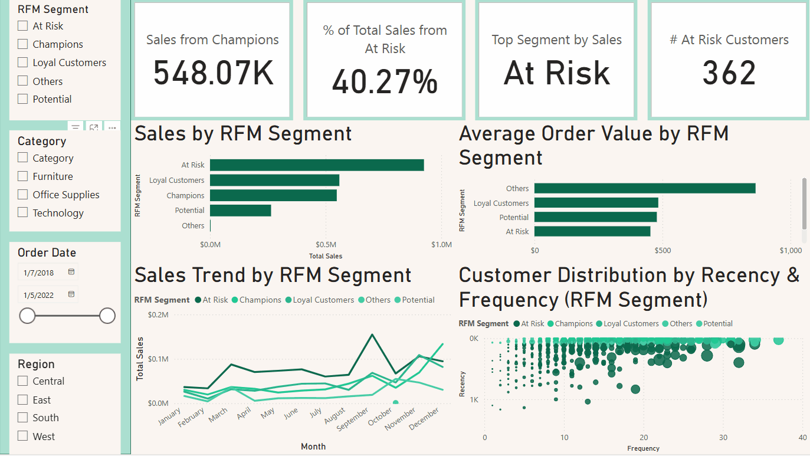
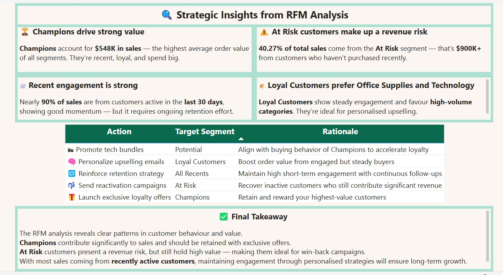

# 🛒 Superstore Sales Analysis | Power BI Dashboard

**Project Type:** Data Analysis & Dashboard Design  
**Tools Used:** Power BI, Excel, DAX  
**Dataset:** [Kaggle - Superstore Dataset](https://www.kaggle.com/datasets/vivek468/superstore-dataset-final)  
**Focus Areas:** Exploratory Data Analysis (EDA), RFM Segmentation, Sales & Customer Insights

---

## 📊 Project Overview

This project explores sales performance and customer behaviour for a fictional retail chain using the **Superstore dataset**. Built in Power BI, the dashboard combines clean visuals, slicer interactivity, and segmentation logic to uncover actionable opportunities in customer engagement and profitability.

---

## 🔍 Key Questions Explored

- Which regions, segments, and product categories drive the most profit?
- How does customer behavior vary across Recency, Frequency, and Monetary dimensions?
- What customer segments are most valuable — and which are at risk?
- How can we translate insights into data-driven business actions?

---

## 🧠 Analytical Highlights

- Applied **RFM Segmentation** to 4,700+ customers using DAX logic
- Found that over **60% of customers** were active in the past 30 days
- Identified **high-frequency, high-monetary** customers for loyalty targeting
- Flagged **low-recency, low-spend** segments as churn risks

---

## 🖼️ Dashboard Previews

### 📌 Sales Overview

  
*High-level performance metrics with dynamic filters*

The West region generated the highest sales, but had lower profit margins compared to Central. The Corporate segment consistently outperformed in profit contribution. Technology products drove the most revenue.

  
*Switching between customer recency groups reveals that nearly **89% of sales** come from customers active within the last 30 days — a strong sign of engagement, but with potential retention risks.*

---

### 📌 RFM Segment Analysis

  
*Customer segments based on Recency, Frequency, and Monetary score combinations*

Over 60% of customers are in the “Recent” group (purchased within 30 days), presenting a strong re-engagement opportunity.

  
*Filtering for “Champions” highlights high average order value and steady spending. “At Risk” customers account for over 40% of total sales — making them a high-priority segment for retention strategies.*

---

### 📌 Recommendations & Action Plan

  
*Summary of strategic actions based on data insights*

---

## 📌 Key Findings

- West region drives the highest sales; Central has stronger profit margins
- Technology leads in revenue, with upselling potential in Office Supplies
- 89% of sales come from customers active in the past 30 days
- “Champions” spend the most per order; “At Risk” customers contribute 40%+ of total revenue
- RFM insights supported loyalty campaigns, retention efforts, and upsell targeting

---

## 🧗 Challenges Faced

- Fine-tuning RFM segmentation logic to balance clarity and insight
- Handling missing categories and data inconsistencies
- Designing intuitive visuals that tell layered stories
- Learning DAX for segmentation and metric calculations
- Establishing a fixed **cutoff date** to ensure accurate recency analysis

---

## ✅ Key Skills Demonstrated

- Data Cleaning & Preparation (Power Query)
- RFM Analysis & Customer Segmentation
- Dashboard Design & Slicer Interactivity
- DAX for calculated logic
- Visual Storytelling & Strategic Thinking

---

## 📂 Resources

- 📦 [Original Dataset (Kaggle)](https://www.kaggle.com/datasets/vivek468/superstore-dataset-final)
- 🖼️ Screenshots & GIFs: See `Assets/` folder
- 🗂️ Power BI file: Available in `Sourcecode (PowerBI)/`

---

## 🎯 Final Thoughts

This case study strengthened my ability to transform raw data into actionable insight through both technical execution and strategic framing. By combining interactivity, segmentation, and storytelling, I’ve built a solution that reflects how real businesses can make smarter customer decisions — and that’s the kind of work I’m ready to keep doing.
